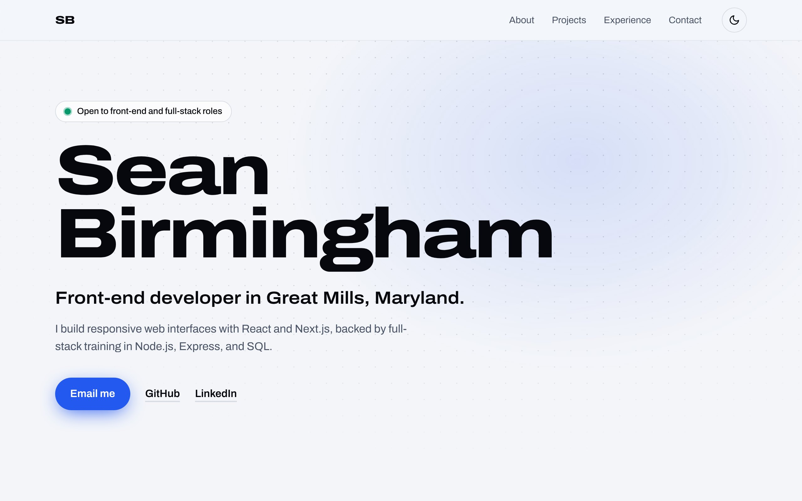

<div align="center">

# Sean Birmingham — Portfolio

**Front-end developer in Great Mills, Maryland**

**[sbirmingham.dev](https://sbirmingham.dev)**

[LinkedIn](https://www.linkedin.com/in/sean-birmingham) · [GitHub](https://github.com/sean-birmingham) · [Email](mailto:sean.birmingham98@gmail.com)

</div>

<picture>
  <source media="(prefers-color-scheme: dark)" srcset=".github/assets/preview-dark.jpg">
  
</picture>

## About

This is the source for my personal portfolio: one page that introduces me, shows what I've built, and makes it easy to get in touch. I designed it around what a hiring manager looks for first, so it leads with who I am, then my projects, then how to reach me.

The page has an intro with my availability, an About section with my bio and the tools I use, my projects ([Crate](https://crate-red-two.vercel.app), a record-shop take on a music player, and [Filmpire](https://filmpire-sbirmingham.netlify.app/), a movie discovery app), my experience, education, and certifications, and a contact form.

## Features

- **Light and dark themes.** The site follows each visitor's system setting, and the header toggle remembers their choice. The saved theme is applied before the page draws, so it never flashes the wrong colors on load.
- **Responsive from small phones to wide screens.** Project screenshots load per device, so phones download a phone-sized image instead of a desktop one.
- **A contact form that works without JavaScript.** Messages go through Web3Forms with a hidden spam trap; with JavaScript off, the form posts directly and still sends.
- **Accessible.** Semantic landmarks and headings, a visible focus ring for keyboard users, a screen-reader label on the icon-only theme toggle, and reduced-motion support.
- **Ready to share.** A custom link-preview image for LinkedIn and messaging apps, plus a sitemap, `robots.txt`, a 404 page, and Vercel Web Analytics.
- **Content kept apart from layout.** My bio, experience, projects, and certifications live in one typed file, `content/profile.ts`.

The design pairs a blue-and-black palette with [Archivo](https://fonts.google.com/specimen/Archivo), whose wide width axis gives the headings their stretched look, over a dot-grid backdrop with a soft blue glow.

## Built with

[](https://skillicons.dev)

Next.js 16 (App Router) · React 19 · TypeScript · Tailwind CSS v4 · Web3Forms · Vercel

## Running it locally

You need [Node.js](https://nodejs.org) 20.9 or later.

```bash
git clone https://github.com/sean-birmingham/portfolio.git
cd portfolio
npm install
npm run dev
```

Then open [http://localhost:3000](http://localhost:3000).

| Command         | What it does                                     |
| --------------- | ------------------------------------------------ |
| `npm run dev`   | Starts the development server                    |
| `npm run build` | Creates a production build                       |
| `npm start`     | Serves the production build (run `build` first)  |

### Environment variables

Both are optional. Copy `.env.example` to `.env.local` and fill in what you need.

| Variable                    | What it's for |
| --------------------------- | ------------- |
| `NEXT_PUBLIC_WEB3FORMS_KEY` | Access key for the contact form, free at [web3forms.com](https://web3forms.com). Without it, the form is hidden and visitors see my email address instead. |
| `NEXT_PUBLIC_SITE_URL`      | The site's public address, used for links in the sitemap, `robots.txt`, and link previews. On Vercel it defaults to the production domain; locally it falls back to `http://localhost:3000`. |

## Project structure

```text
app/          Layout, home page, 404 page, sitemap, robots.txt, icons, and link-preview image
components/   One component per page section, plus the header, theme toggle, and contact form
content/      profile.ts, which holds all of the site's content
public/       My portrait and project screenshots
```

## Updating the content

The bio, availability badge, tech list, experience, education, certifications, and projects all live in `content/profile.ts`; headings and button labels are in the components. Set `availability` to `null` to hide the badge, or leave out a certificate's `url` to hide its link.

To add a project, add an entry to `projects`. Screenshots are optional and go in `public/projects/`. If you add them, a desktop one (16:10) is required; phone (13:20) and tablet (3:4) fall back to the next size up when they're missing.

## Deployment

The site is hosted on [Vercel](https://vercel.com). Add the environment variables above under **Project → Settings → Environment Variables**, and turn on visitor counts in the project's **Analytics** tab.

---

© 2026 Sean Birmingham. All rights reserved. The code, design, and content of this site are not licensed for reuse.
